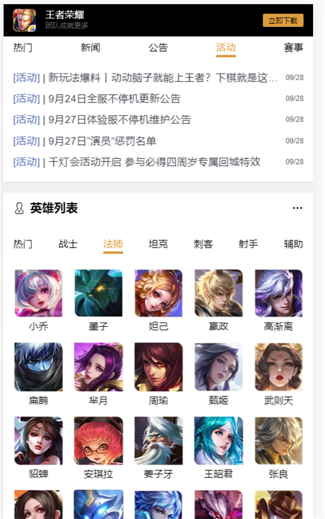
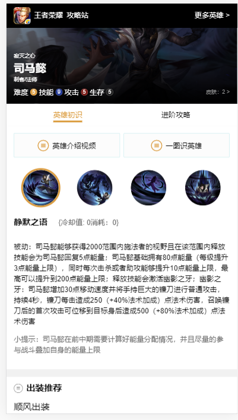
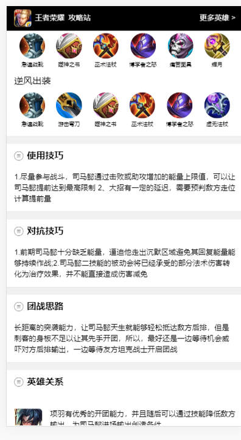
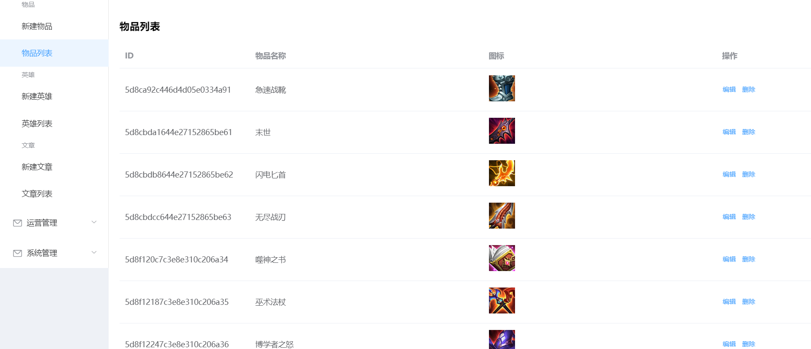
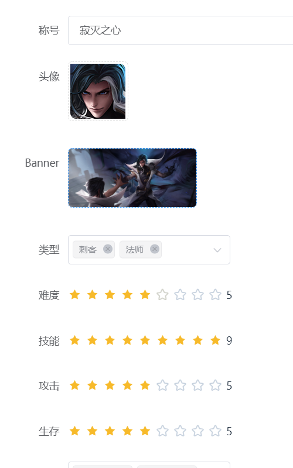
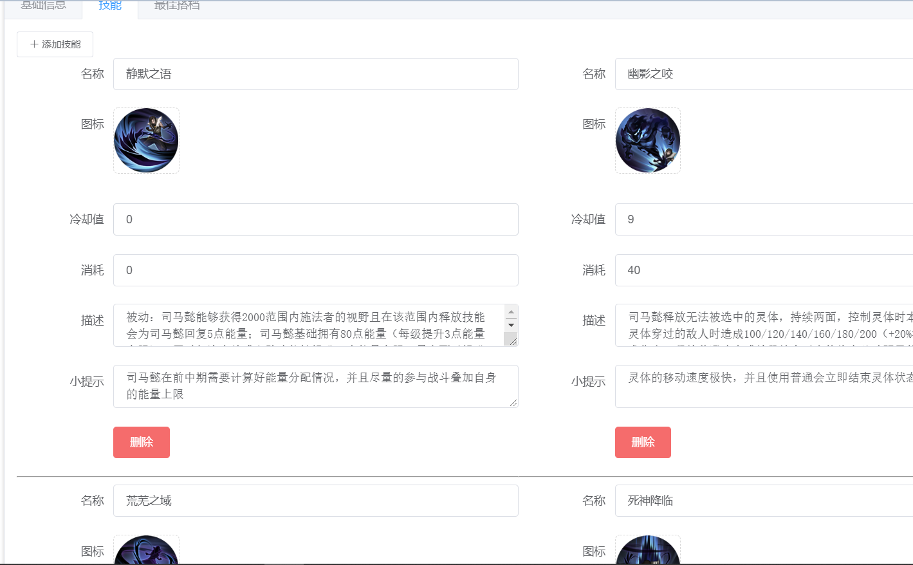
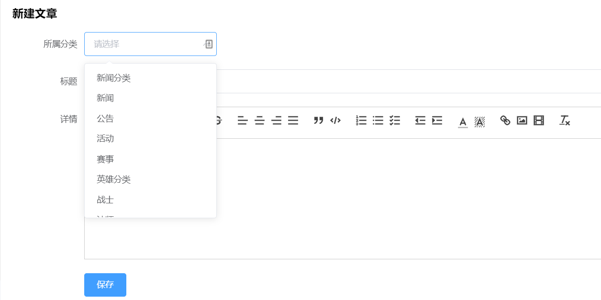
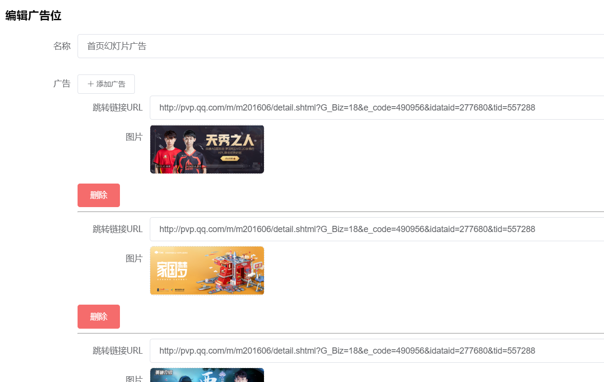

# node-vue

## 简介

​		  全栈练习项目node-vue，admin后台管理系统，server服务端，web前台

此项目基于 Vue全家桶 + Element-UI + node + express 技术栈实现的王者荣耀手机端官网

## 目录结构介绍

|   文件名   |       说明       |
| :--------: | :--------------: |
|   admin    | 后台管理系统文件 |
| screenshot | 项目介绍截图文件 |
|   server   |  服务端项目文件  |
|    web     |   前端项目文件   |
| README.md  |   项目说明文件   |

## 功能

- web：
  - [x] 新闻页
  - [x] 新闻详情
  - [x] 英雄列表
  - [x] 英雄详情页
- admin：
  - [x] 登录和注册管理员
  - [x] 新建装备和装备列表（新建、编辑、删除）
  - [x] 新建（基础信息、添加技能、最佳搭档）、编辑、删除英雄
  - [x] 英雄列表（查看详情等）
  - [x] 新建、编辑、删除文章
  - [x] 广告位（首页轮播图）添加、编辑等
- 待完善：
  - [ ] 更多功能的实现

## 技术栈

- web 、admin：

  |        包名        | 版本号  |         简介         |
  | :----------------: | :-----: | :------------------: |
  |        vue         | ^2.6.10 |       vue框架        |
  | vue-awesome-swiper | ^3.1.3  | 基于swiper的轮播框架 |
  |     vue-router     | ^3.0.3  |       vue路由        |
  |       axios        | ^0.19.0 |      ajax请求库      |
  |       dayjs        | ^1.8.16 |     对date的处理     |
  |     element-ui     | ^2.4.5  |      饿了么UI库      |
  |    vue2-editor     | ^2.10.2 |     富文本编辑器     |

- server：

  |     包名     |     版本号     |        简介         |
  | :----------: | :------------: | :-----------------: |
  |   express    | ^5.0.0-alpha.7 | node.js Web应用框架 |
  |   mongoose   |     ^5.7.1     |       数据库        |
  |    bcrypt    |     ^3.0.6     |        加密         |
  |     cors     |     ^2.8.5     |      跨域处理       |
  | jsonwebtoken |     ^8.5.1     |                     |

## 运行

- 开发环境启动：

  1. 分别 **cd** 到 **admin 、server、web** 文件夹中，执行 **npm install**下载依赖包
  2. 运行 **npm run serve** 启动三个项目

- 打包后启动（预览项目）：

  > 注：配置已将打包后生成的文件自动输出到 **server** 中的 **admin 和 web** 中，作为静态文件处理

  1. **cd** 到  **server** 文件夹中，执行 **npm install**下载依赖包，运行 **npm run serve** 启动项目

  2. 默认端口为3000，

     - 查看web端：http://localhost:3000/

     - 查看admin端：http://localhost:3000/admin

       - 此处默认：

         用户名：admin	

         密	 码：123456

## 效果

效果图

- web：

  

  

  

- admin：

  

  

  

  

  

  

  

  

